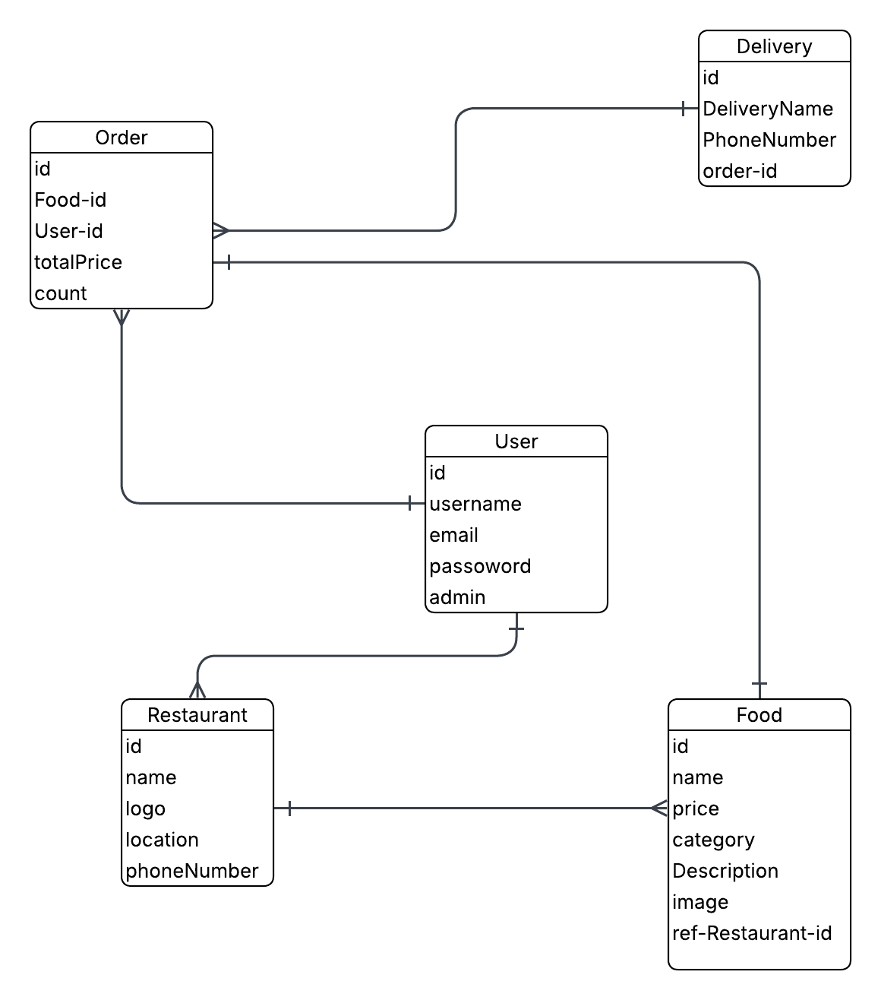

# Project 3 : WASEL

## Date: 16/4/2026

### Created By: Fathy Soliman - Yusuf AlSheikh - Masooma Ebrahim - Zainab Salman

[GitHub]()
[LinkedIn]()
***
[Github]()
[Linkedin]()
***
[GitHub]()
[LinkedIn]()
***
[Github]()
[Linkedin]()
***

### ***Description***
#### WASEL is a delivery application for ordering food, there are three types of users: an admin, who manages the listings of partner restaurants; an owner: who creates and edits restaurant profiles; and a client: who orders food and based on their selections, clients can update, delete, or track their order status, as well as view their order history.
***

### ***Technologies Used***
* Node
* Express
* React
* MongoDB
* Mongoose
* Vite
* JWT
* Axios
***

### ***Getting Started***

#####

##### A Trello board was used to keep track of development progress and can be viewed []
##### The project Wireframe []
##### Component Hierarchy Diagram []

***

### How does the App look like?

**Home page**

##### ERD

### ***Future Updates***

- [ ]
- [ ]
- [ ]
***

### ***Credits***

##### Markdown Guide: [ia.net](https://ia.net/writer/support/general/markdown-guide)

##### Markdown Cheatsheet: [GitHub](https://guides.github.com/pdfs/markdown-cheatsheet-online.pdf)
***
